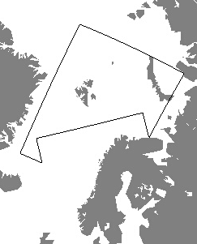

## Data sources

The data sources for locationforecast are divided into three separate regions. Although the forecasts cover the whole globe, the Nordic and Arctic regions are our main priority. In these regions you will find the most frequently updated and accurate forecasts. All forecasts are automatic. There is no manual editing by meteorologists.

#### Nordic area

The weather forecasting model for the Nordic area is the MetCoOp Ensemble Prediction System (**MEPS**). MetCoOp is the Meteorological Cooperation on Operational Numeric  Weather Prediction (NWP) between Finnish Meteorological Institute (FMI), MET Norway, Swedish Meteorological and Hydrological Institute (SMHI) and Estonian Weather Service. It provides short term forecasts (0 - 60 hours) and has a horizontal resolution of 2.5 kilometers. More scientific details about this forecasting system can be found here: [MEPS article](https://doi.org/10.1002/qj.3525)

We also use extensive post-processing to correct for errors in the weather model output caused by  unresolved features such as cold pools, inversions, urban heat islands,  and an intricate coastline. This is  one of the reasons why our forecasts may differ from other forecast providers using MEPS.

Our Nordic forecasts are updated once every hour.

For medium range forecasts (2 - 10 days) the 51 member ensemble forecast from [ECMWF](https://www.ecmwf.int/en/forecasts/datasets/set-iii) is used. It it updated twice pr day. Horizontal resolution is approximately 18 km. Air temperature, precipitation and wind speed are further post-processed to better represent local geographical features.

Historical forecasts short term forecasts for the Nordic region are available for download from our [thredds server](https://thredds.met.no/thredds/metno.html).

#### Arctic area

The weather forecasting model used for the Arctic region is the [AROME-Arctic](https://www.met.no/en/projects/The-weather-model-AROME-Arctic) weather model. It provides short term forecasts (0 - 60 hours) and the horizontal geographic resolution is 2.5 kilometres. The development of AROME-Arctic is done by MET Norway in collaboration with several national and international projects and institutions. The model system is built on HARMONIE-Arome, a configuration of the ALADIN-HIRLAM NWP  system.

Our Arctic forecasts are updated 4 times pr day.

Historical forecasts short term forecasts for the Arctic region are available for download from our [thredds server](https://thredds.met.no/thredds/metno.html)

For medium range forecasts (2 - 10 days) the 51 member ensemble forecast from [ECMWF](https://www.ecmwf.int/en/forecasts/datasets/set-iii) is used. It it updated twice pr day. Horizontal resolution is approximately 18 km.

#### Rest of the world

The source for our global weather forecasts is the high-resolution weather forecasting model from [ECMWF](https://www.ecmwf.int/en/forecasts/datasets/set-i) It is used for forecasts from 0 to 10 days. The horizontal geographic resolution is approximately 9 km. Since the resolution is relatively coarse, care should be taken when using particularly the wind speed forecasts in areas with complex topography. It is also recommended to always include elevation information in the query for a location specific forecast. If elevation is not provided, the 1 kilometer resolution global topography [GMTED2010](https://www.usgs.gov/land-resources/eros/coastal-changes-and-impacts/gmted2010?qt-science_support_page_related_con=0#qt-science_support_page_related_con) is used instead to adjust the air temperature forecasts. Adjustments are made using a standard adiabatic lapse rate.

Our global forecasts are updated 4 times pr day

Historical forecasts are not available from our API.

#### Global UV forecasts

Global UV forecasts are provided by [Copernicus Atmosphere Monitoring Service](https://atmosphere.copernicus.eu/) .

## Variables

|Name|XML tag|Unit|Description|
|-----|----|------|-----|
|**symbol_code**|symbol|string|see WeatherIcon service|
|**air_pressure_at_sea_level**|pressure|hPa| air pressure at sea level |
|**air_temperature**|temperature|celsius| air temperature at 2m above the ground |
|air_temperature_max|maxTemperature|celsius| maximum air temperature over period |
|air_temperature_min|minTemperature|celsius| minimum air temperature over period |
|**cloud_area_fraction**|cloudiness|%| total cloud cover for all heights |
|cloud_area_fraction_high|highClouds|%| cloud cover higher than 5000m above the ground |
|cloud_area_fraction_low|lowClouds|%| cloud cover lower than 2000m above the ground |
|cloud_area_fraction_medium|mediumClouds|%| cloud cover between 2000 and 5000m above the ground |
|dew_point_temperature|dewpointTemperature|celsius| dew point temperature 2m above the ground |
|fog_area_fraction|fog|%| amount of surrounding area covered in fog (horizontal view under a 1000 meters) |
|**precipitation_amount**|precipitation|mm| expected precipitation amount for period |
|precipitation_amount_max|@maxvalue|mm| maximum likely precipitation for period |
|precipitation_amount_min|@minvalue|mm| maximum likely precipitation for period |
|probability_of_precipitation||%| chance of precipitation during period |
|**relative_humidity**|humidity|%| relative humidity at 2m above the ground |
|ultraviolet_index_clear_sky||1| ultraviolet index for cloud free conditions, 0 (low) to 11+ (extreme) |
|**wind_from_direction**|windDirection|degrees| direction the wind is coming from (0° is north, 90° east, etc.) |
|**wind_speed**|windSpeed|m/s| wind speed at 10m above the ground (10 min average) |
|wind_speed_of_gust|windGust|m/s| maximum gust for period at 10m above the ground. Gust is wind speed averaged over 3s. |

Variables in **bold** are included in `compact.json`, others only in `complete.json`. Some variables are not available for every geographic area, so make sure your client can handle that.

The variable names are based on the international [CF Standard Name](https://cfconventions.org/Data/cf-standard-names/29/build/cf-standard-name-table.html) vocabulary, which is mandatory for all governmental scientific institutions under the EU INSPIRE directive.
