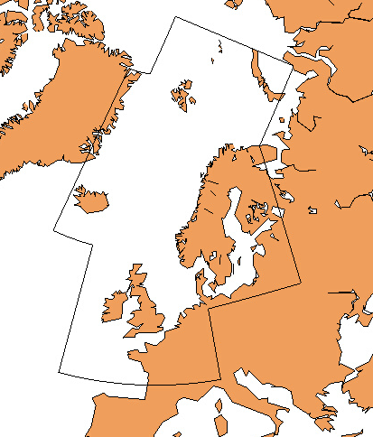

## Data sources

The figure above shows the domain for oceanforecast available at api.met.no.

### Wave models

The wave forecast system at MET Norway uses the spectral models WAVEWATCHIII and WAM. These models describe the evolution in time and space of wind-generated surface gravity waves. Such waves have periods from one second to five minutes. The significant wave height can vary from less than a meter to approximately 22 meters, depending on the wind conditions. The model describes the propagation of waves generated remotely, called “swell”, as well as waves that are closely related to the local winds, called “wind-sea”. The wave field on the ocean surface is a combination of possibly multiple swells and wind-seas.

The regional wave model (WAVEWATCHIII) covers the Norwegian Sea, the North Sea and the Barents Sea. It has a 4 km resolution and is forced by winds from MEPS (2.5 km resolution), together with winds from ECMWF, and with sea-ice concentrations from OSISAF satellite observations. Its boundaries come from the ECMWF. WAVEWATCHIII forecasts are updated 4 times pr day.

MET Norway’s coastal wave models (WAM800) have a grid resolution of 800 meters. They receive boundary spectra from the regional WAVEWATCHIII model, and are forced with winds from MEPS (2.5 km resolution). Their boundaries come from the regional wave model. Forecasts are updated twice pr day.

The pan-Arctic wave forecast model (WAM3) has 3 km resolution and is forced with winds delivered by ECMWF and with sea ice and surface currents (that do not contain tides) from MET Norway’s TOPAZ system. The winds from ECMWF come with a horizontal resolution of approximately 10 km (0.1 x 0.1 degrees) while the ocean currents and sea ice fields come at a resolution of 12.5 km. The boundaries of the pan-Arctic wave model come from ECMWF. WAM3 is used for forecasting from 66 to 240 hours and is updated once pr day.

Historical ocean forecasts are available for download from our [thredds
server](https://thredds.met.no/thredds/fou-hi/fou-hi.html).

## Variables

| Name                            | Unit    | Description                                                                                                                                                  |
|---------------------------------|---------|--------------------------------------------------------------------------------------------------------------------------------------------------------------|
| sea_surface_wave_height         | m       | Significant wave height defined as the average of the highest one-third (33%) of waves (measured from trough to crest)                                       |
| sea_surface_wave_from_direction | degrees | Wave direction follows meteorological convention. It is given as the direction the waves *are coming from* (0° is north, 90° east, etc.)                     |
| sea_water_speed                 | m/s     | Speed of sea water (current)                                                                                                                                 |
| sea_water_to_direction          | degrees | Sea water (current) direction follows oceanographic convention. It is given as the direction the sea water *is moving towards* (0° is north, 90° east, etc.) |
| sea_water_temperature           | celsius | Surface temperature of sea water                                                                                                                             |

The variable names are based on the international [CF Standard
Name](https://cfconventions.org/Data/cf-standard-names/29/build/cf-standard-name-table.html)
vocabulary, which is mandatory for all governmental scientific institutions
under the EU INSPIRE directive.
