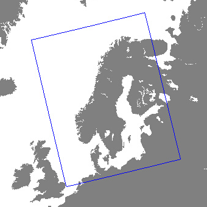

## Data sources

The subseasonal service provides forecasts for the next 21 days.  The forecasts cover Norway, Sweden, Finland and Denmark. The extent of the domain is shown in the illustration below.

The subseasonal forecast is based on 3  weather prediction models:

1. The MetCoOp Ensemble Prediction System [MEPS](https://doi.org/10.1002/qj.3525). MetCoOp is the Meteorological Cooperation on Operational Numeric Weather Prediction (NWP) between Finnish Meteorological 
   Institute (FMI), MET Norway, Swedish Meteorological and Hydrological Institute (SMHI) and Estonian Weather Service. It provides short term forecasts (0 - 60 hours) and has a horizontal resolution of 2.5 kilometers. Forecasts are updated every hour. 
2. The atmospheric model Ensemble 15-day forecast from [ECMWF](https://www.ecmwf.int/en/forecasts/datasets/set-iii. Forecasts are updated twice pr day. Horizontal resolution is approximately 10 km.  These forecasts are used for days 3 - 15.
3.  The Atmospheric Model Ensemble extended forecast from [ECMWF](https://www.ecmwf.int/en/forecasts/datasets/set-iii). Forecasts are updated once every day. Horizontal resolution is approximately 36 km. These forecasts are used for days 15 - 21.

All forecasts are downscaled to a 1x1 km grid and post-processed to better represent local geographical features. They may therefore differ substantially from the original weather prediction models.

## Variables

{:.note}
The list of variables are subject to change and will not be finalized until the product is out of beta.

The variables are aggregations, minima/maxima or average over a time period, either for the next 24 hours or 7 days.

**Next 24 hours**

|Name                               |Unit   |Description              |
|-----------------------------------|:-----:|-------------------------|
|air_temperature_max                |celsius| expected maximum air temperature |
|air_temperature_max_percentile_10  |celsius| 10th percentile of maximum air temperature (i.e 10% chance maximum will be below this value) |
|air_temperature_max_percentile_90  |celsius| 90th percentile of maximum air temperature (i.e 10% chance maximum will be above this value) |
|air_temperature_mean_percentile_10 |celsius| 10th percentile of daily average air temperature (i.e 10% chance mean will be below this value) |
|air_temperature_mean               |celsius| expected daily average temperature |
|air_temperature_mean_percentile_90 |celsius| 90th percentile of daily average air temperature (i.e 10% chance mean will be above this value) |
|air_temperature_min                |celsius| expected minimum air temperature |
|air_temperature_min_percentile_10  |celsius| 10th percentile of minimum air temperature (i.e 10% chance minimum will be below this value) |
|air_temperature_min_percentile_90  |celsius| 90th percentile of minimum air temperature (i.e 10% chance minimum will be above this value) |
|precipitation_amount_percentile_10 |   mm  | 10th percentile of precipitation amount (i.e 10% chance amount will be below this value) |
|precipitation_amount               |   mm  | expected precipitation amount |
|precipitation_amount_percentile_90 |   mm  | 90th percentile of precipitation amount (i.e 10% chance amount will be above this value) | 
|probability_of_frost               |   %   | probability of 2m air temperature below 0 degrees |
|probability_of_precipitation       |   %   | probability of of more than 0.5 mm of precipitation |
|probability_of_heavy_preciptation  |   %   | probability of more than 10 mm of precipitation |

**Next 7 days**

| Name                               |  Unit   | Description                                                  |
| ---------------------------------- | :-----: | ------------------------------------------------------------ |
| precipitation_amount               |   mm    | precipitation amount                                         |
| precipitation_amount_percentile_10 |   mm    | 10th percentile of precipitation amount (i.e 10% chance it will be below this value) |
| precipitation_amount_percentile_90 |   mm    | 90th percentile of precipitation amount (i.e 10% chance it will be above this value) |
| probability_of_frost               |    %    | probability of 2m air temperature below 0 degrees               |

The variable names are based on the international [CF Standard Name](https://cfconventions.org/Data/cf-standard-names/29/build/cf-standard-name-table.html) vocabulary, which is mandatory for all governmental scientific institutions under the EU INSPIRE directive.
